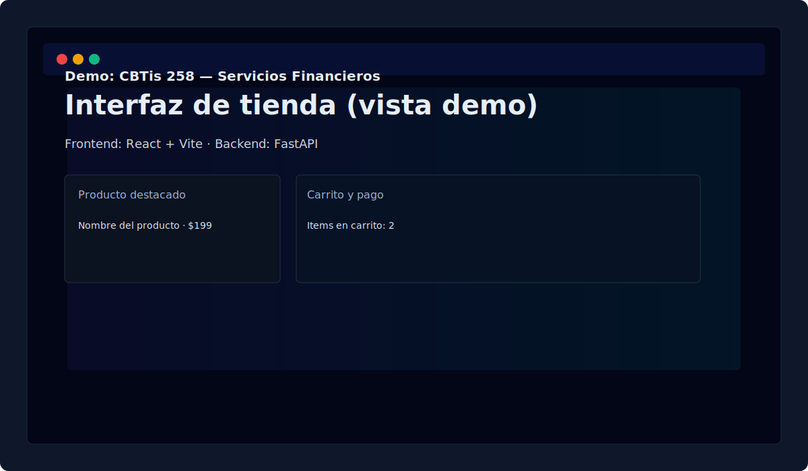

# CBTis 258 — Servicios Financieros

[](https://github.com/josemendozaalonso097-debug/proyecto-juasjaus/actions)


Breve descripción: proyecto de laboratorio para CBTis 258 con backend en FastAPI y frontend en React + Vite. Este README ofrece pasos claros para instalar, ejecutar y depurar la aplicación en entornos locales.

---

## Tabla de contenidos

- [Resumen](#resumen)
- [Requisitos](#requisitos)
- [Instalación rápida](#instalaci%C3%B3n-r%C3%A1pida)
- [Ejecución (desarrollo)](#ejecuci%C3%B3n-desarrollo)
- [Ejecución manual](#ejecuci%C3%B3n-manual)
- [Detener la aplicación](#detener-la-aplicaci%C3%B3n)
- [Solución de problemas](#soluci%C3%B3n-de-problemas)
- [Contribuir](#contribuir)
- [Contacto](#contacto)

---

## Resumen

Este repositorio contiene:

- `backend/`: API en Python con FastAPI.
- `frontend-react/`: frontend con React + Vite.
- Scripts de utilidad: `run.sh`, `start-dev.sh`, `start-dev.bat`.

La carpeta legacy `frontend/` fue eliminada. Use `frontend-react/` para desarrollo y despliegue.

### Vista previa



---

## Requisitos

- Python 3.10 o superior
- Node.js 20.x (recomendado usar `nvm`)
- npm (o `yarn`)
- Git

---

## Instalación rápida

1. Clonar el repositorio:

```bash
git clone https://github.com/josemendozaalonso097-debug/proyecto-juasjaus.git
cd proyecto-juasjaus
```

2. Backend: crear `venv` e instalar dependencias:

```bash
python3 -m venv .venv
source .venv/bin/activate
pip install --upgrade pip
pip install -r backend/requirements.txt
```

3. Crear el archivo `backend/.env` con al menos:

```env
SECRET_KEY=una_clave_secreta_larga
```

4. Frontend: instalar dependencias (usar Node 20):

```bash
nvm install 20 # si usas nvm
nvm use 20
cd frontend-react
npm install
```

---

## Ejecución (desarrollo)

- Arranque rápido (Linux/macOS/WSL):

```bash
chmod +x run.sh
./run.sh
```

- Arranque completo (Linux/macOS) — procesos en background con logs:

```bash
chmod +x start-dev.sh
./start-dev.sh
# Logs: backend/uvicorn.log  frontend-react/dev.log
```

- Windows (CMD):

```cmd
start-dev.bat
```

URLs:

- Frontend: http://localhost:5501/
- Backend: http://localhost:8000/
- OpenAPI: http://localhost:8000/docs

---

## Ejecución manual

Si prefieres ejecutar cada servicio en su propia terminal:

Backend:

```bash
cd backend
source ../.venv/bin/activate
uvicorn app.main:app --reload
```

Frontend:

```bash
cd frontend-react
npm run dev -- --port 5501
```

---

## Detener la aplicación

Si usaste `start-dev.sh`, los procesos escriben sus PIDs en `frontend-react/vite.pid` y `backend/uvicorn.pid`. Para detenerlos:

```bash
kill "$(cat frontend-react/vite.pid)" || true && rm -f frontend-react/vite.pid
kill "$(cat backend/uvicorn.pid)" || true && rm -f backend/uvicorn.pid
```

---

## Solución de problemas comunes

- Problema: `SECRET_KEY` faltante -> crea `backend/.env` con `SECRET_KEY=...`.
- Problema: errores de `npm` o bindings nativos -> elimina `node_modules` y `package-lock.json`, reinstala:

```bash
cd frontend-react
rm -rf node_modules package-lock.json
npm install
```

- Problema: versión de Node incompatible -> usa `nvm install 20 && nvm use 20`.

---

## Contribuir

1. Crea un fork y una rama descriptiva.
2. Abre un Pull Request con una explicación clara.
3. Añade tests o instrucciones de verificación si aplican.

---

## Contacto

Mantén issues en el repositorio para problemas, o contáctame por PRs/commits.

---

Si quieres, puedo:

- agregar una tabla de contenidos con anclas más detalladas,
- incrustar capturas de pantalla o GIFs, o
- añadir CI para lint/tests.


